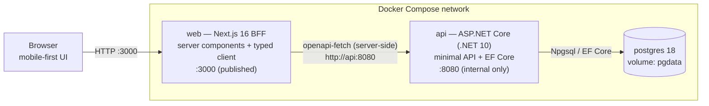
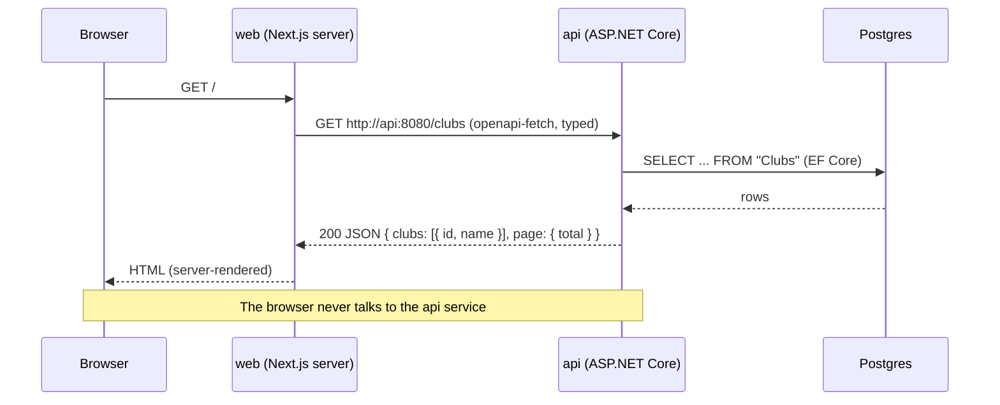
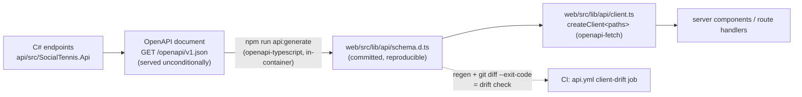
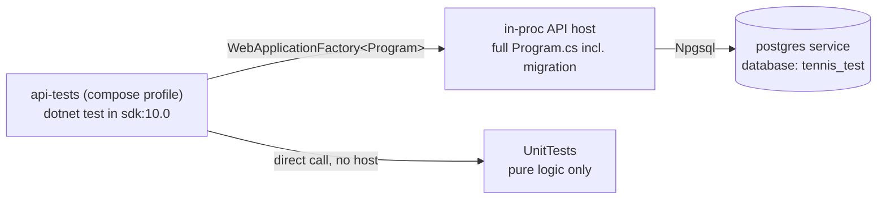
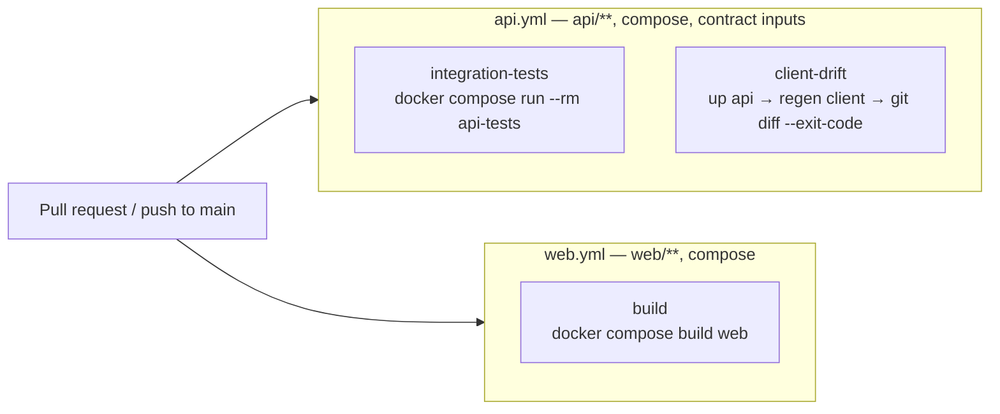

# Architecture

> **Maintenance contract**: this document describes the system *as built* and must change in the same commit as the code that invalidates it — see `CLAUDE.md` ("Keep `docs/architecture.md` current"). If a diagram here disagrees with the code, the document is wrong: fix it with the change that made it wrong.

Technical documentation for the system as built. The **domain** lives in [CONTEXT.md](../CONTEXT.md), the **decisions and their rationale** in [docs/adr/](adr/), the **plan** in the [GitHub issues](https://github.com/l1em1on1/social-tennis/issues) (#1 is the spec; #2–#22 the tracer-bullet tickets). This file documents the *mechanism*: what runs where, and how the pieces talk.

## System topology

Three services under one Docker Compose project (ADR-0001, ADR-0005). The browser only ever reaches the Next.js BFF; the API has **no published port** and is reachable solely on the compose-internal network. CORS never arises, and auth tokens (from ticket #3 onward) stay server-side.



## Request flow

The home page is a **server component** rendered per request (`export const dynamic = "force-dynamic"` — no build-time snapshot). It calls the API directly from the server with the generated typed client; no route-handler hop, per Next.js BFF guidance.



## Authentication

Passwordless magic-link login (ADR-0004), with the session held as an **opaque, revocable API credential** — no JWTs, no key management; logout is a row update and takes effect immediately.

```mermaid
sequenceDiagram
    participant B as Browser
    participant W as web (BFF)
    participant A as api
    participant P as Postgres

    B->>W: submit email on /login
    W->>A: POST /auth/magic-link { email }
    A->>P: upsert User, store SHA-256(link token), expiry
    A-->>W: 202 (always — no user enumeration)
    Note over A: IMagicLinkSender delivers the link<br/>(v1: logged; real email is #19)
    B->>W: GET /auth/verify?token=…
    W->>A: POST /auth/sessions { token }
    A->>P: token unused + unexpired? mark used, create session (hashed)
    A-->>W: 200 { session token, expiresAt }
    W-->>B: 307 / + HttpOnly st_session cookie
    B->>W: any page
    W->>A: Authorization: Bearer session token
    Note over B,W: Browser holds only the HttpOnly cookie —<br/>never sees an API credential it can read
```

Mechanics worth knowing:

- **Tokens at rest are SHA-256 hashes** (`MagicLinkTokens`, `SessionTokens`); the raw values exist only in the emailed link and the cookie. A database leak leaks nothing redeemable.
- **Magic links are single-use and expiring** (config: `Auth:MagicLinkLifetimeMinutes`, default 15); sessions expire after `Auth:SessionLifetimeDays` (default 30) and die instantly on logout (`RevokedAt`).
- **Two gates on the web side**: `src/proxy.ts` (Next 16's renamed middleware) redirects visitors with no session cookie to `/login` — a presence check only; real validity is enforced per request by the API's `SessionToken` Bearer scheme, and a 401 sends the page back to `/login`.
- **Redirect origins** come from `PUBLIC_BASE_URL` (compose env), because a containerized server's own origin is its bind address — unroutable from a browser.
- **OAuth-readiness** (ADR-0004): `ExternalLogins` (provider + subject, unique) hangs off `User`, empty in v1 — adding Google later is additive.
- **Delivery seam**: `IMagicLinkSender`, registered as a logging implementation (the dev-retrievable link); #19 replaces it with real email; tests substitute a capturing fake.

## Contract pipeline

The API is the source of truth for the contract. Types flow one way, C# → TypeScript, and the generated client is **committed** so drift is detectable (a CI gate once #20 lands).



Regenerating with no API change produces no diff — verified property, and the basis of the drift check.

## Repository layout

```
/
├── CONTEXT.md                  domain glossary (ubiquitous language)
├── docs/
│   ├── adr/                    architecture decision records 0001–0012
│   ├── agents/                 agent workflow docs (issue tracker, triage, domain, endpoints)
│   └── architecture.md         this file
├── docker-compose.yml          base stack: postgres + api + web (+ api-tests profile)
├── docker-compose.dev.yml      dev overlay: bind mounts, dotnet watch, next dev
├── .devcontainer/              VS Code Dev Container (.NET 10 + Node 24 toolchains)
├── api/
│   ├── SocialTennis.slnx       .NET 10 solution (new XML format)
│   ├── Dockerfile              multi-stage: sdk:10.0 build → aspnet:10.0 runtime
│   ├── dotnet-tools.json       local tool manifest (dotnet-ef)
│   ├── src/SocialTennis.Api/
│   │   ├── Program.cs          minimal API: DI, migrate-on-start, feature registration, OpenAPI
│   │   ├── Domain/             entities (Club, User, ExternalLogin, tokens, ...)
│   │   ├── Data/               TennisDbContext + seed
│   │   ├── Features/           vertical slices: handler per endpoint + routing table (ADR-0010)
│   │   │   ├── Auth/           magic-link request/redeem, current user, logout
│   │   │   │   └── Contracts/  one file per request/response record
│   │   │   └── Clubs/          club listing
│   │   │       └── Contracts/  one file per request/response record
│   │   ├── Contracts/          cross-feature contracts — PageInfo (ADR-0012)
│   │   ├── Validation/         FluentValidation filter + ValidatesBody<,>() (ADR-0011)
│   │   ├── Authentication/     session Bearer scheme, sender seam, options, token hashing
│   │   └── Migrations/         EF Core migrations
│   └── tests/
│       ├── SocialTennis.Api.IntegrationTests/   HTTP + real Postgres
│       └── SocialTennis.Api.UnitTests/          pure logic only, no DbContext
└── web/
    ├── Dockerfile              multi-stage: node:24 build → standalone runtime
    ├── next.config.ts          output: "standalone"
    └── src/
        ├── proxy.ts            route gate (Next 16 middleware successor)
        ├── app/                App Router: / (authed), /login, /auth/verify
        └── lib/
            ├── api/            generated schema.d.ts, client.ts, server.ts (session-aware)
            └── session.ts      cookie name + public-origin helper
```

## Runtime configurations

One compose file is the truth for topology; overlays change *how* services run, never *what* they are (ADR-0005 as amended: nothing on the host but Docker).

| | Base (`docker compose up`) | Dev overlay (`-f docker-compose.dev.yml`) | Dev Container |
|---|---|---|---|
| api | Built image (publish, `aspnet:10.0`) | `sdk:10.0` + bind mount + `dotnet watch` | Editor toolchain; stack still via compose |
| web | Built image (standalone `server.js`) | `node:24-alpine` + bind mount + `next dev` | 〃 |
| postgres | `postgres:18-alpine`, `pgdata` volume | same | same |
| Use for | Prod-like verification | Day-to-day development | IntelliSense, debugging, terminals |

Named volumes: `pgdata` (database, survives restarts; `down -v` resets), `nuget` (package cache), `web_node_modules` (keeps `node_modules` off the Windows bind mount).

## Database and migrations

EF Core migrations live in the API project; **the API applies them on startup** (`MigrateAsync` behind an `EF.IsDesignTime` guard), so `docker compose up` needs no separate migration step. Per EF Core guidance this pattern fits dev/test and single-instance deployments — which v1 is; the exit is scripted migrations (`dotnet ef migrations script`) before scaling past one API instance.

New migrations are generated in-container — see the [README](../README.md) for the exact commands (README is the canonical command reference; this file doesn't duplicate it).

## Testing seam

The default seam, per the spec's Testing Decisions (issue #1): integration tests drive the API **over its HTTP boundary against a real Postgres** — no mocked repositories, no in-memory provider. Anything touching the database is tested this way.

ADR-0010 adds one narrow exception rather than a second general seam. Because endpoint handlers and request validators are directly callable, pure logic **with no `DbContext`** may be unit-tested in `SocialTennis.Api.UnitTests`. That project references no test host, so the boundary is structural: if a test needs the database, it cannot live there. For validators the boundary is stronger still — ADR-0011's `new()` constraint means a validator cannot take a `DbContext` even in principle.



The test host runs the real `Program.cs` — including startup migration — against a separate `tennis_test` database on the same Postgres service, so tests are isolated from dev data but identical in behaviour.

`OpenApiContractTests` uses the same host but asserts on the **generated OpenAPI document** rather than on any endpoint's behaviour — currently that no 2xx JSON response is a bare array (ADR-0012). This is where repo-wide contract rules get enforced when no type-level mechanism can express them; it tests the published wire surface, so it holds regardless of how the C# is written.

## CI

Two path-triggered GitHub Actions workflows (ADR-0002), every step a `docker compose` invocation with the same images and commands as local dev — nothing runs bare on the runner:



Caveat (from GitHub's docs): a workflow skipped by path filtering leaves its checks *pending* — if these jobs are ever made **required** checks in branch protection, docs-only PRs would block; at that point drop the paths filters or add no-op twin workflows with the same job names.

## Versions and notable pins

| Component | Version | Note |
|---|---|---|
| .NET / ASP.NET Core / EF Core | 10.0 (LTS) | Solution uses the `.slnx` format (SDK 10 default) |
| Npgsql.EntityFrameworkCore.PostgreSQL | 10.0.x | EF Relational pinned explicitly to 10.0.10 to unify versions |
| Microsoft.OpenApi | 2.11.0 | Template's 2.0.0 has GHSA-v5pm-xwqc-g5wc; 3.x breaks the .NET 10 OpenAPI source generator |
| FluentValidation | 12.1.1 | Core package only — validators are constructed, not DI-resolved (ADR-0011) |
| Next.js / React | 16.3 / 19.2 | `output: "standalone"` for the Docker runtime image |
| Node | 24 (LTS) | Container-only, never on the host |
| Postgres | 18-alpine | Volume mounted at `/var/lib/postgresql` (18+ image layout) |
| openapi-typescript / openapi-fetch | 7.x / 0.17.x | `js-yaml` override in `web/package.json` clears a dev-chain CVE |

## Where this goes next

The skeleton exists so every following ticket only adds domain, never plumbing: #3 adds the BFF-held session (magic link), #18 the Admin/Club bootstrap. The ticket graph and its dependencies are wired as native GitHub issue dependencies on #2–#22.
